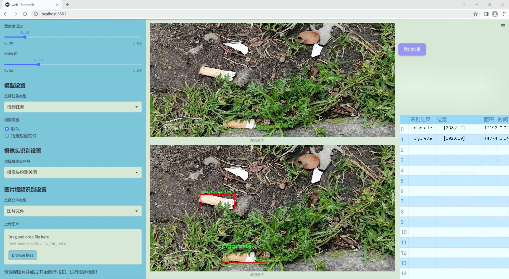

### 1.背景意义

研究背景与意义

随着城市化进程的加快，城市环境污染问题日益严重，尤其是路边垃圾的随意丢弃，成为影响城市形象和居民生活质量的重要因素。烟头和一次性杯子等常见垃圾不仅影响市容，还对生态环境造成了严重威胁。烟头的主要成分为塑料和化学物质，降解周期长，极易对土壤和水源造成污染；而一次性杯子则在使用后往往被随意丢弃，增加了城市垃圾处理的负担。因此，开发一种高效的垃圾分类检测系统，能够及时识别和分类这些常见垃圾，对于提升城市环境管理水平、推动可持续发展具有重要意义。

近年来，深度学习技术在计算机视觉领域取得了显著进展，尤其是目标检测算法的快速发展，使得实时垃圾分类成为可能。YOLO（You Only Look Once）系列算法因其高效性和准确性，广泛应用于各种目标检测任务。YOLOv11作为该系列的最新版本，结合了更为先进的特征提取和分类机制，能够在复杂环境中实现高效的目标检测。通过对YOLOv11进行改进，能够进一步提升其在烟头和一次性杯子等小型目标检测中的性能，增强系统的实用性。

本研究旨在基于改进的YOLOv11算法，构建一个针对烟头和一次性杯子的分类检测系统。通过利用2277张标注清晰的图像数据集，系统将能够实现对路边垃圾的实时监测与分类，为城市管理者提供有效的数据支持。同时，该系统的推广应用，将有助于提高公众的环保意识，促进垃圾分类的落实，进而推动城市环境的改善和可持续发展。

### 2.视频效果

[2.1 视频效果](https://www.bilibili.com/video/BV1UjmtYQEAa/)

### 3.图片效果




##### [项目涉及的源码数据来源链接](https://kdocs.cn/l/cszuIiCKVNis)**

注意：本项目提供训练的数据集和训练教程,由于版本持续更新,暂不提供权重文件（best.pt）,请按照6.训练教程进行训练后实现上图演示的效果。

### 4.数据集信息

##### 4.1 本项目数据集类别数＆类别名

nc: 2
names: ['cigarette', 'cup']


该项目为【目标检测】数据集，请在【训练教程和Web端加载模型教程（第三步）】这一步的时候按照【目标检测】部分的教程来训练

##### 4.2 本项目数据集信息介绍

本项目数据集信息介绍

本项目旨在开发一个改进版的YOLOv11模型，以实现对烟头及其他常见路边垃圾的高效分类检测。为此，我们构建了一个专门的数据集，涵盖了两类主要对象：烟头（cigarette）和杯子（cup）。该数据集的设计不仅考虑了物体的多样性和复杂性，还注重了实际应用场景中的环境因素，以确保模型在真实世界中的有效性和可靠性。

数据集中包含了大量的图像样本，这些样本均经过精心挑选和标注，确保每一类对象都能在不同的背景和光照条件下被清晰识别。烟头和杯子作为路边垃圾的典型代表，反映了城市环境中常见的污染问题。通过对这两类物体的分类检测，项目旨在提升城市垃圾管理的智能化水平，促进环境保护和可持续发展。

在数据集的构建过程中，我们特别关注了图像的多样性，包括不同的拍摄角度、距离和背景。这种多样性不仅有助于提高模型的泛化能力，还能有效应对现实世界中可能遇到的各种挑战。此外，数据集还包含了不同材质和颜色的杯子，以增强模型对相似物体的区分能力。

通过使用这一数据集，我们希望能够训练出一个能够准确识别和分类烟头与杯子的检测系统，从而为城市环境治理提供技术支持。该系统的成功实施将有助于提高公众对垃圾分类的意识，促进垃圾的有效回收与处理，为建设更美好的城市环境贡献力量。


### 5.全套项目环境部署视频教程（零基础手把手教学）

[5.1 所需软件PyCharm和Anaconda安装教程（第一步）](https://www.bilibili.com/video/BV1BoC1YCEKi/?spm_id_from=333.999.0.0&vd_source=bc9aec86d164b67a7004b996143742dc)


[5.2 安装Python虚拟环境创建和依赖库安装视频教程（第二步）](https://www.bilibili.com/video/BV1ZoC1YCEBw?spm_id_from=333.788.videopod.sections&vd_source=bc9aec86d164b67a7004b996143742dc)

### 6.改进YOLOv11训练教程和Web_UI前端加载模型教程（零基础手把手教学）

[6.1 改进YOLOv11训练教程和Web_UI前端加载模型教程（第三步）](https://www.bilibili.com/video/BV1BoC1YCEhR?spm_id_from=333.788.videopod.sections&vd_source=bc9aec86d164b67a7004b996143742dc)


按照上面的训练视频教程链接加载项目提供的数据集，运行train.py即可开始训练



     Epoch   gpu_mem       box       obj       cls    labels  img_size
     1/200     20.8G   0.01576   0.01955  0.007536        22      1280: 100%|██████████| 849/849 [14:42<00:00,  1.04s/it]
               Class     Images     Labels          P          R     mAP@.5 mAP@.5:.95: 100%|██████████| 213/213 [01:14<00:00,  2.87it/s]
                 all       3395      17314      0.994      0.957      0.0957      0.0843

     Epoch   gpu_mem       box       obj       cls    labels  img_size
     2/200     20.8G   0.01578   0.01923  0.007006        22      1280: 100%|██████████| 849/849 [14:44<00:00,  1.04s/it]
               Class     Images     Labels          P          R     mAP@.5 mAP@.5:.95: 100%|██████████| 213/213 [01:12<00:00,  2.95it/s]
                 all       3395      17314      0.996      0.956      0.0957      0.0845

     Epoch   gpu_mem       box       obj       cls    labels  img_size
     3/200     20.8G   0.01561    0.0191  0.006895        27      1280: 100%|██████████| 849/849 [10:56<00:00,  1.29it/s]
               Class     Images     Labels          P          R     mAP@.5 mAP@.5:.95: 100%|███████   | 187/213 [00:52<00:00,  4.04it/s]
                 all       3395      17314      0.996      0.957      0.0957      0.0845


###### [项目数据集下载链接](https://kdocs.cn/l/cszuIiCKVNis)

### 7.原始YOLOv11算法讲解


ultralytics发布了最新的作品YOLOv11，这一次YOLOv11的变化相对于ultralytics公司的上一代作品YOLOv8变化不是很大的（YOLOv9、YOLOv10均不是ultralytics公司作品），其中改变的位置涉及到C2f变为C3K2，在SPPF后面加了一层类似于注意力机制的C2PSA，还有一个变化大家从yaml文件是看不出来的就是它的检测头内部替换了两个DWConv，以及模型的深度和宽度参数进行了大幅度调整，但是在损失函数方面就没有变化还是采用的CIoU作为边界框回归损失，下面带大家深入理解一下ultralytics最新作品YOLOv11的创新点。

**下图为最近的YOLO系列发布时间线！**


* * *

###### YOLOv11和YOLOv8对比

在YOLOYOLOv5，YOLOv8，和YOLOv11是ultralytics公司作品（ultralytics出品必属精品），下面用一张图片从yaml文件来带大家对比一下YOLOv8和YOLOv11的区别，配置文件变得内容比较少大家可以看一卡，左侧为YOLOv8右侧为YOLOv11，不同的点我用黑线标注了出来。


* * *

###### YOLOv11的网络结构解析

下面的图片为YOLOv11的网络结构图。


**其中主要创新点可以总结如下- > **

* * *

1\.
提出C3k2机制，其中C3k2有参数为c3k，其中在网络的浅层c3k设置为False（下图中可以看到c3k2第二个参数被设置为False，就是对应的c3k参数）。


此时所谓的C3k2就相当于YOLOv8中的C2f，其网络结构为一致的，其中的C3k机制的网络结构图如下图所示
**（为什么叫C3k2，我个人理解是因为C3k的调用时C3k其中的参数N固定设置为2的原因，个人理解不一定对** ）。


* * *

2\.
第二个创新点是提出C2PSA机制，这是一个C2（C2f的前身）机制内部嵌入了一个多头注意力机制，在这个过程中我还发现作者尝试了C2fPSA机制但是估计效果不如C2PSA，有的时候机制有没有效果理论上真的很难解释通，下图为C2PSA机制的原理图，仔细观察把Attention哪里去掉则C2PSA机制就变为了C2所以我上面说C2PSA就是C2里面嵌入了一个PSA机制。


* * *

3\.
第三个创新点可以说是原先的解耦头中的分类检测头增加了两个DWConv，具体的对比大家可以看下面两个图下面的是YOLOv11的解耦头，上面的是YOLOv8的解耦头.


我们上面看到了在分类检测头中YOLOv11插入了两个DWConv这样的做法可以大幅度减少参数量和计算量（原先两个普通的Conv大家要注意到卷积和是由3变为了1的，这是形成了两个深度可分离Conv），大家可能不太理解为什么加入了两个DWConv还能够减少计算量，以及什么是深度可分离Conv，下面我来解释一下。

> **`DWConv` 代表 Depthwise
> Convolution（深度卷积）**，是一种在卷积神经网络中常用的高效卷积操作。它主要用于减少计算复杂度和参数量，尤其在移动端或轻量化网络（如
> MobileNet）中十分常见。
>
> **1\. 标准卷积的计算过程**
>
> 在标准卷积操作中，对于一个输入张量（通常是一个多通道的特征图），卷积核的尺寸是 `(h, w, C_in)`，其中 `h` 和 `w`
> 是卷积核的空间尺寸，`C_in`
> 是输入通道的数量。而卷积核与输入张量做的是完整的卷积运算，每个输出通道都与所有输入通道相连并参与卷积操作，导致计算量比较大。
>
> 标准卷积的计算过程是这样的：
>
>   * 每个输出通道是所有输入通道的组合（加权求和），卷积核在每个位置都会计算与所有输入通道的点积。
>   * 假设有 `C_in` 个输入通道和 `C_out` 个输出通道，那么卷积核的总参数量是 `C_in * C_out * h * w`。
>

>
> 2\. **Depthwise Convolution（DWConv）**
>
> 与标准卷积不同， **深度卷积** 将输入的每个通道单独处理，即 **每个通道都有自己的卷积核进行卷积**
> ，不与其他通道进行交互。它可以被看作是标准卷积的一部分，专注于空间维度上的卷积运算。
>
> **深度卷积的计算过程：**
>
>   * 假设输入张量有 `C_in` 个通道，每个通道会使用一个 `h × w`
> 的卷积核进行卷积操作。这个过程称为“深度卷积”，因为每个通道独立进行卷积运算。
>   * 输出的通道数与输入通道数一致，每个输出通道只和对应的输入通道进行卷积，没有跨通道的组合。
>   * 参数量和计算量相比标准卷积大大减少，卷积核的参数量是 `C_in * h * w`。
>

>
> **深度卷积的优点：**
>
>   1. **计算效率高** ：相对于标准卷积，深度卷积显著减少了计算量。它只处理空间维度上的卷积，不再处理通道间的卷积。
>   2.  **参数量减少** ：由于每个卷积核只对单个通道进行卷积，参数量大幅减少。例如，标准卷积的参数量为 `C_in * C_out * h *
> w`，而深度卷积的参数量为 `C_in * h * w`。
>   3.  **结合点卷积可提升效果** ：为了弥补深度卷积缺乏跨通道信息整合的问题，通常深度卷积后会配合 `1x1` 的点卷积（Pointwise
> Convolution）使用，通过 `1x1` 的卷积核整合跨通道的信息。这种组合被称为 **深度可分离卷积** （Depthwise
> Separable Convolution） | **这也是我们本文YOLOv11中的做法** 。
>

>
> 3\. **深度卷积与标准卷积的区别**
>
> 操作类型| 卷积核大小| 输入通道数| 输出通道数| 参数量  
> ---|---|---|---|---  
> 标准卷积| `h × w`| `C_in`| `C_out`| `C_in * C_out * h * w`  
> 深度卷积（DWConv）| `h × w`| `C_in`| `C_in`| `C_in * h * w`  
>  
> 可以看出，深度卷积在相同的卷积核大小下，参数量减少了约 `C_out` 倍
> （细心的人可以发现用最新版本的ultralytics仓库运行YOLOv8参数量相比于之前的YOLOv8以及大幅度减少了这就是因为检测头改了的原因但是名字还是Detect，所以如果你想继续用YOLOv8发表论文做实验那么不要更新最近的ultralytics仓库）。
>
> **4\. 深度可分离卷积 (Depthwise Separable Convolution)**
>
> 深度卷积常与 `1x1` 的点卷积配合使用，这称为深度可分离卷积。其过程如下：
>
>   1. 先对输入张量进行深度卷积，对每个通道独立进行空间卷积。
>   2. 然后通过 `1x1` 点卷积，对通道维度进行混合，整合不同通道的信息。
>

>
> 这样既可以保证计算量的减少，又可以保持跨通道的信息流动。
>
> 5\. **总结**
>
> `DWConv` 是一种高效的卷积方式，通过单独处理每个通道来减少计算量，结合 `1x1`
> 的点卷积，形成深度可分离卷积，可以在保持网络性能的同时极大地减少模型的计算复杂度和参数量。

**看到这里大家应该明白了为什么加入了两个DWConv还能减少参数量以及YOLOv11的检测头创新点在哪里。**

* * *

##### YOLOv11和YOLOv8还有一个不同的点就是其各个版本的模型（N - S - M- L - X）网络深度和宽度变了


可以看到在深度（depth）和宽度
（width）两个地方YOLOv8和YOLOv11是基本上完全不同了，这里我理解这么做的含义就是模型网络变小了，所以需要加深一些模型的放缩倍数来弥补模型之前丧失的能力从而来达到一个平衡。

> **本章总结：**
> YOLOv11的改进点其实并不多更多的都是一些小的结构上的创新，相对于之前的YOLOv5到YOLOv8的创新，其实YOLOv11的创新点不算多，但是其是ultralytics公司的出品，同时ultralytics仓库的使用量是非常多的（不像YOLOv9和YOLOv10）所以在未来的很长一段时间内其实YOLO系列估计不会再更新了，YOLOv11作为最新的SOTA肯定是十分适合大家来发表论文和创新的。
>

### 8.200+种全套改进YOLOV11创新点原理讲解

#### 8.1 200+种全套改进YOLOV11创新点原理讲解大全

由于篇幅限制，每个创新点的具体原理讲解就不全部展开，具体见下列网址中的改进模块对应项目的技术原理博客网址【Blog】（创新点均为模块化搭建，原理适配YOLOv5~YOLOv11等各种版本）

[改进模块技术原理博客【Blog】网址链接](https://gitee.com/qunmasj/good)


#### 8.2 精选部分改进YOLOV11创新点原理讲解

###### 这里节选部分改进创新点展开原理讲解(完整的改进原理见上图和[改进模块技术原理博客链接](https://gitee.com/qunmasj/good)【如果此小节的图加载失败可以通过CSDN或者Github搜索该博客的标题访问原始博客，原始博客图片显示正常】
### FasterNet简介
神经网络在图像分类、检测和分割等各种计算机视觉任务中经历了快速发展。尽管其令人印象深刻的性能为许多应用程序提供了动力，但一个巨大的趋势是追求具有低延迟和高吞吐量的快速神经网络，以获得良好的用户体验、即时响应和安全原因等。

如何快速？研究人员和从业者不需要更昂贵的计算设备，而是倾向于设计具有成本效益的快速神经网络，降低计算复杂度，主要以浮点运算（FLOPs）的数量来衡量。

MobileNet、ShuffleNet和GhostNet等利用深度卷积（DWConv）和/或组卷积（GConv）来提取空间特征。然而，在减少FLOPs的过程中，算子经常会受到内存访问增加的副作用的影响。MicroNet进一步分解和稀疏网络，将其FLOPs推至极低水平。尽管这种方法在FLOPs方面有所改进，但其碎片计算效率很低。此外，上述网络通常伴随着额外的数据操作，如级联、Shuffle和池化，这些操作的运行时间对于小型模型来说往往很重要。

除了上述纯卷积神经网络（CNNs）之外，人们对使视觉Transformer（ViTs）和多层感知器（MLP）架构更小更快也越来越感兴趣。例如，MobileViT和MobileFormer通过将DWConv与改进的注意力机制相结合，降低了计算复杂性。然而，它们仍然受到DWConv的上述问题的困扰，并且还需要修改的注意力机制的专用硬件支持。使用先进但耗时的标准化和激活层也可能限制其在设备上的速度。

所有这些问题一起导致了以下问题：这些“快速”的神经网络真的很快吗？为了回答这个问题，作者检查了延迟和FLOPs之间的关系，这由


其中FLOPS是每秒浮点运算的缩写，作为有效计算速度的度量。虽然有许多减少FLOPs的尝试，但都很少考虑同时优化FLOPs以实现真正的低延迟。为了更好地理解这种情况，作者比较了Intel CPU上典型神经网络的FLOPS。


图中的结果表明，许多现有神经网络的FLOPS较低，其FLOPS通常低于流行的ResNet50。由于FLOPS如此之低，这些“快速”的神经网络实际上不够快。它们的FLOPs减少不能转化为延迟的确切减少量。在某些情况下，没有任何改善，甚至会导致更糟的延迟。例如，CycleMLP-B1具有ResNet50的一半FLOPs，但运行速度较慢（即CycleMLPB1与ResNet50:111.9ms与69.4ms）。

请注意，FLOPs与延迟之间的差异在之前的工作中也已被注意到，但由于它们采用了DWConv/GConv和具有低FLOPs的各种数据处理，因此部分问题仍未解决。人们认为没有更好的选择。

该博客提供的方案通过开发一种简单、快速、有效的运算符来消除这种差异，该运算符可以在减少FLOPs的情况下保持高FLOPS。

具体来说，作者重新审视了现有的操作符，特别是DWConv的计算速度——FLOPS。作者发现导致低FLOPS问题的主要原因是频繁的内存访问。然后，作者提出了PConv作为一种竞争性替代方案，它减少了计算冗余以及内存访问的数量。

图1说明了PConv的设计。它利用了特征图中的冗余，并系统地仅在一部分输入通道上应用规则卷积（Conv），而不影响其余通道。本质上，PConv的FLOPs低于常规Conv，而FLOPs高于DWConv/GConv。换句话说，PConv更好地利用了设备上的计算能力。PConv在提取空间特征方面也很有效，这在本文后面的实验中得到了验证。

作者进一步引入PConv设计了FasterNet作为一个在各种设备上运行速度非常快的新网络家族。特别是，FasterNet在分类、检测和分割任务方面实现了最先进的性能，同时具有更低的延迟和更高的吞吐量。例如，在GPU、CPU和ARM处理器上，小模型FasterNet-T0分别比MobileVitXXS快3.1倍、3.1倍和2.5倍，而在ImageNet-1k上的准确率高2.9%。大模型FasterNet-L实现了83.5%的Top-1精度，与Swin-B不相上下，同时在GPU上提供了49%的高吞吐量，在CPU上节省了42%的计算时间。

总之，贡献如下：

指出了实现更高FLOPS的重要性，而不仅仅是为了更快的神经网络而减少FLOPs。

引入了一种简单但快速且有效的卷积PConv，它很有可能取代现有的选择DWConv。

推出FasterNet，它在GPU、CPU和ARM处理器等多种设备上运行良好且普遍快速。

对各种任务进行了广泛的实验，并验证了PConv和FasterNet的高速性和有效性。

### Conv和FasterNet的设计
#### 原理

DWConv是Conv的一种流行变体，已被广泛用作许多神经网络的关键构建块。对于输入，DWConv应用个滤波器来计算输出。如图（b）所示，每个滤波器在一个输入通道上进行空间滑动，并对一个输出通道做出贡献。

与具有的FLOPs常规Conv相比，这种深度计算使得DWConv仅仅具有的FLOPs。虽然在减少FLOPs方面有效，但DWConv（通常后跟逐点卷积或PWConv）不能简单地用于替换常规Conv，因为它会导致严重的精度下降。因此，在实践中，DWConv的通道数（或网络宽度）增加到＞以补偿精度下降，例如，倒置残差块中的DWConv宽度扩展了6倍。然而，这会导致更高的内存访问，这会造成不可忽略的延迟，并降低总体计算速度，尤其是对于I/O绑定设备。特别是，内存访问的数量现在上升到


它比一个常规的Conv的值要高，即，


注意，内存访问花费在I/O操作上，这被认为已经是最小的成本，很难进一步优化。

#### PConv作为一个基本的算子


在下面演示了通过利用特征图的冗余度可以进一步优化成本。如图所示，特征图在不同通道之间具有高度相似性。许多其他著作也涵盖了这种冗余，但很少有人以简单而有效的方式充分利用它。


具体而言，作者提出了一种简单的PConv，以同时减少计算冗余和内存访问。图4中的左下角说明了PConv的工作原理。它只需在输入通道的一部分上应用常规Conv进行空间特征提取，并保持其余通道不变。对于连续或规则的内存访问，将第一个或最后一个连续的通道视为整个特征图的代表进行计算。在不丧失一般性的情况下认为输入和输出特征图具有相同数量的通道。因此，PConv的FLOPs仅


对于典型的r＝1/4 ，PConv的FLOPs只有常规Conv的1/16。此外，PConv的内存访问量较小，即：


对于r＝1/4，其仅为常规Conv的1/4。

由于只有通道用于空间特征提取，人们可能会问是否可以简单地移除剩余的（c−）通道？如果是这样，PConv将退化为具有较少通道的常规Conv，这偏离了减少冗余的目标。

请注意，保持其余通道不变，而不是从特征图中删除它们。这是因为它们对后续PWConv层有用，PWConv允许特征信息流经所有通道。

#### PConv之后是PWConv


为了充分有效地利用来自所有通道的信息，进一步将逐点卷积（PWConv）附加到PConv。它们在输入特征图上的有效感受野看起来像一个T形Conv，与均匀处理补丁的常规Conv相比，它更专注于中心位置，如图5所示。为了证明这个T形感受野的合理性，首先通过计算位置的Frobenius范数来评估每个位置的重要性。


假设，如果一个职位比其他职位具有更大的Frobenius范数，则该职位往往更重要。对于正则Conv滤波器，位置处的Frobenius范数由计算，其中。


一个显著位置是具有最大Frobenius范数的位置。然后，在预训练的ResNet18中集体检查每个过滤器，找出它们的显著位置，并绘制显著位置的直方图。图6中的结果表明，中心位置是过滤器中最常见的突出位置。换句话说，中心位置的权重比周围的更重。这与集中于中心位置的T形计算一致。

虽然T形卷积可以直接用于高效计算，但作者表明，将T形卷积分解为PConv和PWConv更好，因为该分解利用了滤波器间冗余并进一步节省了FLOPs。对于相同的输入和输出，T形Conv的FLOPs可以计算为:


它高于PConv和PWConv的流量，即：


其中和（例如，当时）。此外，可以很容易地利用常规Conv进行两步实现。

# FasterNet作为Backbone
鉴于新型PConv和现成的PWConv作为主要的算子，进一步提出FasterNet，这是一个新的神经网络家族，运行速度非常快，对许多视觉任务非常有效。目标是使体系结构尽可能简单，使其总体上对硬件友好。


在图中展示了整体架构。它有4个层次级，每个层次级前面都有一个嵌入层（步长为4的常规4×4卷积）或一个合并层（步长为2的常规2×2卷积），用于空间下采样和通道数量扩展。每个阶段都有一堆FasterNet块。作者观察到，最后两个阶段中的块消耗更少的内存访问，并且倾向于具有更高的FLOPS，如表1中的经验验证。因此，放置了更多FasterNet块，并相应地将更多计算分配给最后两个阶段。每个FasterNet块有一个PConv层，后跟2个PWConv（或Conv 1×1）层。它们一起显示为倒置残差块，其中中间层具有扩展的通道数量，并且放置了Shorcut以重用输入特征。

除了上述算子，标准化和激活层对于高性能神经网络也是不可或缺的。然而，许多先前的工作在整个网络中过度使用这些层，这可能会限制特征多样性，从而损害性能。它还可以降低整体计算速度。相比之下，只将它们放在每个中间PWConv之后，以保持特征多样性并实现较低的延迟。

此外，使用批次归一化（BN）代替其他替代方法。BN的优点是，它可以合并到其相邻的Conv层中，以便更快地进行推断，同时与其他层一样有效。对于激活层，根据经验选择了GELU用于较小的FasterNet变体，而ReLU用于较大的FasterNet变体，同时考虑了运行时间和有效性。最后三个层，即全局平均池化、卷积1×1和全连接层，一起用于特征转换和分类。

为了在不同的计算预算下提供广泛的应用，提供FasterNet的Tiny模型、Small模型、Medium模型和Big模型变体，分别称为FasterNetT0/1/2、FasterNet-S、FasterNet-M和FasterNet-L。它们具有相似的结构，但深度和宽度不同。

架构规范如下：


### 9.系统功能展示

图9.1.系统支持检测结果表格显示

  图9.2.系统支持置信度和IOU阈值手动调节

  图9.3.系统支持自定义加载权重文件best.pt(需要你通过步骤5中训练获得)

  图9.4.系统支持摄像头实时识别

  图9.5.系统支持图片识别

  图9.6.系统支持视频识别

  图9.7.系统支持识别结果文件自动保存

  图9.8.系统支持Excel导出检测结果数据


### 10. YOLOv11核心改进源码讲解

#### 10.1 UniRepLKNet.py

以下是对给定代码的核心部分进行分析和注释的结果。为了保持代码的简洁性和可读性，我将只保留最核心的部分，并添加详细的中文注释。

```python
import torch
import torch.nn as nn
import torch.nn.functional as F

class GRNwithNHWC(nn.Module):
    """ 
    GRN (Global Response Normalization) 层
    用于归一化输入特征图的响应。
    """
    def __init__(self, dim, use_bias=True):
        super().__init__()
        self.use_bias = use_bias
        self.gamma = nn.Parameter(torch.zeros(1, 1, 1, dim))  # 可学习的缩放参数
        if self.use_bias:
            self.beta = nn.Parameter(torch.zeros(1, 1, 1, dim))  # 可学习的偏置参数

    def forward(self, x):
        Gx = torch.norm(x, p=2, dim=(1, 2), keepdim=True)  # 计算L2范数
        Nx = Gx / (Gx.mean(dim=-1, keepdim=True) + 1e-6)  # 归一化
        if self.use_bias:
            return (self.gamma * Nx + 1) * x + self.beta  # 应用缩放和偏置
        else:
            return (self.gamma * Nx + 1) * x

class UniRepLKNetBlock(nn.Module):
    """ 
    UniRepLKNet的基本构建块
    包含深度卷积、归一化、Squeeze-and-Excitation块和前馈网络。
    """
    def __init__(self, dim, kernel_size, drop_path=0., deploy=False):
        super().__init__()
        self.dwconv = nn.Conv2d(dim, dim, kernel_size=kernel_size, stride=1, padding=kernel_size // 2, groups=dim)  # 深度卷积
        self.norm = nn.BatchNorm2d(dim)  # 批归一化
        self.se = SEBlock(dim, dim // 4)  # Squeeze-and-Excitation块
        self.pwconv1 = nn.Linear(dim, dim * 4)  # 前馈网络第一层
        self.pwconv2 = nn.Linear(dim * 4, dim)  # 前馈网络第二层
        self.drop_path = nn.Identity() if drop_path <= 0 else DropPath(drop_path)  # 随机深度

    def forward(self, inputs):
        x = self.dwconv(inputs)  # 深度卷积
        x = self.norm(x)  # 归一化
        x = self.se(x)  # Squeeze-and-Excitation
        x = F.gelu(self.pwconv1(x))  # GELU激活
        x = self.pwconv2(x)  # 前馈网络
        return self.drop_path(x) + inputs  # 残差连接

class UniRepLKNet(nn.Module):
    """ 
    UniRepLKNet模型
    由多个UniRepLKNetBlock组成。
    """
    def __init__(self, in_chans=3, num_classes=1000, depths=(3, 3, 27, 3), dims=(96, 192, 384, 768)):
        super().__init__()
        self.downsample_layers = nn.ModuleList()  # 下采样层
        self.stages = nn.ModuleList()  # 各个阶段的块

        # 初始化下采样层
        self.downsample_layers.append(nn.Conv2d(in_chans, dims[0] // 2, kernel_size=3, stride=2, padding=1))
        for i in range(3):
            self.downsample_layers.append(nn.Conv2d(dims[i], dims[i + 1], kernel_size=3, stride=2, padding=1))

        # 初始化各个阶段的UniRepLKNetBlock
        for i in range(4):
            stage = nn.Sequential(*[UniRepLKNetBlock(dim=dims[i], kernel_size=3) for _ in range(depths[i])])
            self.stages.append(stage)

    def forward(self, x):
        for stage in self.stages:
            x = stage(x)  # 通过每个阶段
        return x

# 定义模型实例和前向传播
if __name__ == '__main__':
    inputs = torch.randn((1, 3, 640, 640))  # 输入张量
    model = UniRepLKNet()  # 创建模型实例
    res = model(inputs)  # 前向传播
    print(res.shape)  # 输出结果的形状
```

### 代码分析与注释
1. **GRNwithNHWC**: 这是一个全局响应归一化层，主要用于调整特征图的响应，使其在不同通道之间保持一致性。它通过计算L2范数并进行归一化来实现。

2. **UniRepLKNetBlock**: 这是UniRepLKNet的基本构建块，包含深度卷积、归一化、Squeeze-and-Excitation模块和前馈网络。它通过残差连接来增强模型的表达能力。

3. **UniRepLKNet**: 这是整个模型的主体，包含多个阶段的UniRepLKNetBlock。它通过下采样层逐步减少特征图的空间维度，并通过每个阶段的块进行特征提取。

4. **前向传播**: 在`__main__`部分，创建了一个随机输入并通过模型进行前向传播，最后输出结果的形状。

这些核心部分构成了UniRepLKNet模型的基础，能够处理多种输入数据并进行特征提取。

该文件实现了一个名为UniRepLKNet的深度学习模型，主要用于音频、视频、点云、时间序列和图像识别。该模型的设计灵感来源于多个前沿的网络架构，包括RepLKNet、ConvNeXt、DINO和DeiT。文件中包含了多个类和函数，下面将逐一进行分析。

首先，文件引入了必要的库，包括PyTorch和一些自定义的模块。然后定义了一些全局变量，列出了可用的模型变体，如unireplknet_a、unireplknet_f等。

接下来，定义了GRNwithNHWC类，该类实现了全局响应归一化（Global Response Normalization）层，主要用于调整输入特征的分布。它的前向传播方法计算输入的L2范数，并根据均值进行归一化处理。

NCHWtoNHWC和NHWCtoNCHW类则用于在不同的张量格式之间进行转换，方便在模型中使用。

get_conv2d函数用于根据输入参数选择合适的卷积实现，支持原生卷积和高效的iGEMM大核卷积实现。该函数会根据卷积核的大小、步幅、填充等参数决定使用哪种实现。

get_bn函数则用于返回合适的批归一化层，支持同步批归一化和普通批归一化。

SEBlock类实现了Squeeze-and-Excitation模块，通过自适应地调整通道的权重来增强特征表达能力。该模块首先通过全局平均池化生成通道描述符，然后通过两个1x1卷积进行压缩和扩展，最后与输入特征相乘。

fuse_bn函数用于将卷积层和批归一化层融合，以减少推理时的计算量。

接下来的几个函数主要用于处理卷积核的扩张和合并，提供了对扩张卷积的支持，能够将扩张卷积的权重合并到大卷积核中。

DilatedReparamBlock类实现了扩张重参数化块，允许在推理阶段使用更高效的卷积结构。该类根据输入的参数设置不同的卷积核大小和扩张率，并在前向传播中执行相应的卷积操作。

UniRepLKNetBlock类则是UniRepLKNet的基本构建块，结合了卷积、归一化、激活和Squeeze-and-Excitation模块。它支持不同的部署模式和内存优化策略。

UniRepLKNet类是整个模型的核心，负责构建网络的不同阶段和层。它接受多个参数，如输入通道数、类别数、每个阶段的深度和特征维度等。模型的初始化过程中，会根据深度设置默认的卷积核大小，并构建下采样层和各个阶段的块。

最后，文件中还定义了一些用于创建不同变体的函数（如unireplknet_a、unireplknet_f等），这些函数可以加载预训练权重，并返回相应的模型实例。

在主程序部分，创建了一个随机输入并实例化了unireplknet_a模型，随后进行了前向传播并输出了结果。这部分代码还展示了如何将模型切换到推理模式，并比较了融合前后的输出差异。

总体而言，该文件实现了一个灵活且高效的深度学习模型，能够适应多种输入类型和任务需求。通过模块化的设计，便于后续的扩展和修改。

#### 10.2 fadc.py

以下是代码中最核心的部分，并附上详细的中文注释：

```python
import torch
import torch.nn as nn
import torch.nn.functional as F

class OmniAttention(nn.Module):
    def __init__(self, in_planes, out_planes, kernel_size, groups=1, reduction=0.0625, kernel_num=4, min_channel=16):
        super(OmniAttention, self).__init__()
        # 计算注意力通道数
        attention_channel = max(int(in_planes * reduction), min_channel)
        self.kernel_size = kernel_size
        self.kernel_num = kernel_num
        self.temperature = 1.0  # 温度参数，用于调整注意力的平滑程度

        # 定义各个层
        self.avgpool = nn.AdaptiveAvgPool2d(1)  # 自适应平均池化
        self.fc = nn.Conv2d(in_planes, attention_channel, 1, bias=False)  # 全连接层
        self.bn = nn.BatchNorm2d(attention_channel)  # 批归一化
        self.relu = nn.ReLU(inplace=True)  # ReLU激活函数

        # 定义通道注意力层
        self.channel_fc = nn.Conv2d(attention_channel, in_planes, 1, bias=True)
        self.func_channel = self.get_channel_attention

        # 定义滤波器注意力层
        if in_planes == groups and in_planes == out_planes:  # 深度可分离卷积
            self.func_filter = self.skip
        else:
            self.filter_fc = nn.Conv2d(attention_channel, out_planes, 1, bias=True)
            self.func_filter = self.get_filter_attention

        # 定义空间注意力层
        if kernel_size == 1:  # 点卷积
            self.func_spatial = self.skip
        else:
            self.spatial_fc = nn.Conv2d(attention_channel, kernel_size * kernel_size, 1, bias=True)
            self.func_spatial = self.get_spatial_attention

        # 定义核注意力层
        if kernel_num == 1:
            self.func_kernel = self.skip
        else:
            self.kernel_fc = nn.Conv2d(attention_channel, kernel_num, 1, bias=True)
            self.func_kernel = self.get_kernel_attention

        self._initialize_weights()  # 初始化权重

    def _initialize_weights(self):
        # 权重初始化
        for m in self.modules():
            if isinstance(m, nn.Conv2d):
                nn.init.kaiming_normal_(m.weight, mode='fan_out', nonlinearity='relu')
                if m.bias is not None:
                    nn.init.constant_(m.bias, 0)
            if isinstance(m, nn.BatchNorm2d):
                nn.init.constant_(m.weight, 1)
                nn.init.constant_(m.bias, 0)

    def get_channel_attention(self, x):
        # 计算通道注意力
        channel_attention = torch.sigmoid(self.channel_fc(x).view(x.size(0), -1, 1, 1) / self.temperature)
        return channel_attention

    def get_filter_attention(self, x):
        # 计算滤波器注意力
        filter_attention = torch.sigmoid(self.filter_fc(x).view(x.size(0), -1, 1, 1) / self.temperature)
        return filter_attention

    def get_spatial_attention(self, x):
        # 计算空间注意力
        spatial_attention = self.spatial_fc(x).view(x.size(0), 1, 1, 1, self.kernel_size, self.kernel_size)
        spatial_attention = torch.sigmoid(spatial_attention / self.temperature)
        return spatial_attention

    def get_kernel_attention(self, x):
        # 计算核注意力
        kernel_attention = self.kernel_fc(x).view(x.size(0), -1, 1, 1, 1, 1)
        kernel_attention = F.softmax(kernel_attention / self.temperature, dim=1)
        return kernel_attention

    def forward(self, x):
        # 前向传播
        x = self.avgpool(x)  # 自适应平均池化
        x = self.fc(x)  # 全连接层
        x = self.bn(x)  # 批归一化
        x = self.relu(x)  # ReLU激活
        return self.func_channel(x), self.func_filter(x), self.func_spatial(x), self.func_kernel(x)

class AdaptiveDilatedConv(nn.Module):
    """自适应膨胀卷积类，封装了可调节的卷积层。"""
    
    def __init__(self, in_channels, out_channels, kernel_size, stride=1, padding=0, dilation=1, groups=1, bias=True):
        super(AdaptiveDilatedConv, self).__init__()
        self.conv = nn.Conv2d(in_channels, out_channels, kernel_size, stride=stride, padding=padding, dilation=dilation, groups=groups, bias=bias)
        self.omni_attention = OmniAttention(in_channels, out_channels, kernel_size)  # 添加OmniAttention模块

    def forward(self, x):
        # 前向传播
        attention_weights = self.omni_attention(x)  # 获取注意力权重
        x = self.conv(x)  # 卷积操作
        # 根据注意力权重调整输出
        return x * attention_weights[0]  # 仅使用通道注意力

# 其他类和函数省略
```

### 代码核心部分解释：
1. **OmniAttention 类**：实现了多种注意力机制，包括通道注意力、滤波器注意力、空间注意力和核注意力。通过对输入特征进行加权，增强模型对重要特征的关注。
2. **AdaptiveDilatedConv 类**：封装了自适应膨胀卷积，结合了 `OmniAttention`，使得卷积操作能够根据输入特征自适应调整，提升了特征提取的能力。

以上是代码的核心部分和详细注释，其他辅助类和函数可以根据需要进行扩展和实现。

这个程序文件 `fadc.py` 实现了一些用于深度学习的模块，主要包括自适应膨胀卷积、频率选择和全局注意力机制等功能。文件中使用了 PyTorch 框架，具体功能如下：

首先，文件导入了必要的库，包括 PyTorch 和 NumPy。接着，它定义了一个名为 `OmniAttention` 的类，这个类实现了一种全局注意力机制。该类的构造函数接受多个参数，包括输入和输出通道数、卷积核大小、组数、通道减少比例等。它通过多个卷积层和激活函数来计算通道注意力、过滤器注意力、空间注意力和卷积核注意力。`forward` 方法将输入张量经过平均池化、全连接层和激活函数，输出不同类型的注意力权重。

接下来，文件中定义了一个 `generate_laplacian_pyramid` 函数，用于生成拉普拉斯金字塔。该函数接受输入张量、金字塔层数和其他参数，通过逐层下采样和上采样来构建金字塔，并返回每一层的拉普拉斯图像。

然后，定义了 `FrequencySelection` 类，它用于选择特定频率的特征。该类支持多种频率选择方法，包括平均池化和拉普拉斯金字塔。构造函数中初始化了多个卷积层和频率选择策略。`forward` 方法根据输入特征和选择的频率类型计算输出。

最后，定义了 `AdaptiveDilatedConv` 和 `AdaptiveDilatedDWConv` 类，这两个类是对可调节的可变形卷积的封装。它们继承自 `ModulatedDeformConv2d`，并在构造函数中设置了卷积的偏移量、掩码和频率选择模块。`forward` 方法中，输入张量经过偏移、掩码和自适应权重计算，输出经过处理的特征图。

整个文件的结构设计旨在通过引入注意力机制和频率选择，增强卷积神经网络在处理图像时的灵活性和表现力。这些模块可以用于各种计算机视觉任务，如图像分类、目标检测等。

#### 10.3 SwinTransformer.py

以下是简化后的代码，保留了核心部分，并添加了详细的中文注释：

```python
import torch
import torch.nn as nn
import torch.nn.functional as F
import numpy as np

class Mlp(nn.Module):
    """ 多层感知机（MLP）模块。 """

    def __init__(self, in_features, hidden_features=None, out_features=None, act_layer=nn.GELU, drop=0.):
        super().__init__()
        out_features = out_features or in_features  # 输出特征数
        hidden_features = hidden_features or in_features  # 隐藏层特征数
        self.fc1 = nn.Linear(in_features, hidden_features)  # 第一层线性变换
        self.act = act_layer()  # 激活函数
        self.fc2 = nn.Linear(hidden_features, out_features)  # 第二层线性变换
        self.drop = nn.Dropout(drop)  # Dropout层

    def forward(self, x):
        """ 前向传播函数。 """
        x = self.fc1(x)  # 线性变换
        x = self.act(x)  # 激活
        x = self.drop(x)  # Dropout
        x = self.fc2(x)  # 线性变换
        x = self.drop(x)  # Dropout
        return x

class WindowAttention(nn.Module):
    """ 基于窗口的多头自注意力模块。 """

    def __init__(self, dim, window_size, num_heads):
        super().__init__()
        self.dim = dim  # 输入通道数
        self.window_size = window_size  # 窗口大小
        self.num_heads = num_heads  # 注意力头数
        head_dim = dim // num_heads  # 每个头的维度
        self.scale = head_dim ** -0.5  # 缩放因子

        # 相对位置偏置参数
        self.relative_position_bias_table = nn.Parameter(
            torch.zeros((2 * window_size[0] - 1) * (2 * window_size[1] - 1), num_heads))

        # 计算相对位置索引
        coords_h = torch.arange(self.window_size[0])
        coords_w = torch.arange(self.window_size[1])
        coords = torch.stack(torch.meshgrid([coords_h, coords_w]))  # 生成坐标网格
        coords_flatten = torch.flatten(coords, 1)  # 展平坐标
        relative_coords = coords_flatten[:, :, None] - coords_flatten[:, None, :]  # 计算相对坐标
        relative_coords = relative_coords.permute(1, 2, 0).contiguous()  # 变换维度
        relative_coords[:, :, 0] += self.window_size[0] - 1  # 偏移
        relative_coords[:, :, 1] += self.window_size[1] - 1
        relative_coords[:, :, 0] *= 2 * self.window_size[1] - 1
        self.relative_position_index = relative_coords.sum(-1)  # 相对位置索引

        self.qkv = nn.Linear(dim, dim * 3)  # 线性变换生成Q, K, V
        self.softmax = nn.Softmax(dim=-1)  # Softmax层

    def forward(self, x):
        """ 前向传播函数。 """
        B_, N, C = x.shape  # B: 批量大小, N: 序列长度, C: 通道数
        qkv = self.qkv(x).reshape(B_, N, 3, self.num_heads, C // self.num_heads).permute(2, 0, 3, 1, 4)
        q, k, v = qkv[0], qkv[1], qkv[2]  # 分离Q, K, V

        q = q * self.scale  # 缩放Q
        attn = (q @ k.transpose(-2, -1))  # 计算注意力分数

        # 添加相对位置偏置
        relative_position_bias = self.relative_position_bias_table[self.relative_position_index.view(-1)].view(
            self.window_size[0] * self.window_size[1], self.window_size[0] * self.window_size[1], -1)
        attn = attn + relative_position_bias.unsqueeze(0)  # 加入偏置

        attn = self.softmax(attn)  # Softmax归一化
        x = (attn @ v).transpose(1, 2).reshape(B_, N, C)  # 计算输出
        return x

class SwinTransformer(nn.Module):
    """ Swin Transformer主干网络。 """

    def __init__(self, embed_dim=96, depths=[2, 2, 6, 2], num_heads=[3, 6, 12, 24], window_size=7):
        super().__init__()
        self.embed_dim = embed_dim  # 嵌入维度
        self.layers = nn.ModuleList()  # 存储各层

        # 构建每一层
        for i_layer in range(len(depths)):
            layer = WindowAttention(
                dim=int(embed_dim * 2 ** i_layer),
                window_size=(window_size, window_size),
                num_heads=num_heads[i_layer])
            self.layers.append(layer)

    def forward(self, x):
        """ 前向传播函数。 """
        for layer in self.layers:
            x = layer(x)  # 逐层传递
        return x

def SwinTransformer_Tiny():
    """ 创建一个小型的Swin Transformer模型。 """
    model = SwinTransformer(depths=[2, 2, 6, 2], num_heads=[3, 6, 12, 24])
    return model
```

### 代码说明
1. **Mlp类**：实现了一个简单的多层感知机，包含两层线性变换和激活函数，支持Dropout。
2. **WindowAttention类**：实现了窗口注意力机制，支持相对位置偏置的计算。
3. **SwinTransformer类**：构建了Swin Transformer的主干网络，包含多个窗口注意力层。
4. **SwinTransformer_Tiny函数**：用于创建一个小型的Swin Transformer模型。

该代码是Swin Transformer模型的简化版本，保留了核心功能和结构。

这个程序文件实现了Swin Transformer模型，主要用于计算机视觉任务。Swin Transformer是一种分层的视觉Transformer，使用了窗口注意力机制，能够有效处理高分辨率图像。

文件中首先导入了必要的库，包括PyTorch及其模块。接着定义了多个类和函数来构建Swin Transformer的各个组件。

首先是`Mlp`类，它实现了一个多层感知机（MLP），包含两个线性层和一个激活函数（默认为GELU），并在每个线性层后应用了Dropout。

接下来是`window_partition`和`window_reverse`函数，这两个函数用于将输入特征分割成窗口和将窗口合并回特征图。`window_partition`将输入特征按照指定的窗口大小划分为多个小窗口，而`window_reverse`则将这些小窗口合并回原始的特征图。

`WindowAttention`类实现了基于窗口的多头自注意力机制（W-MSA），支持相对位置偏置。它在前向传播中计算查询、键、值，并应用注意力机制，同时考虑相对位置偏置。

`SwinTransformerBlock`类是Swin Transformer的基本构建块，包含了归一化层、窗口注意力层和MLP。它在前向传播中首先对输入进行归一化，然后通过窗口注意力层进行处理，最后通过MLP进行进一步的特征提取。

`PatchMerging`类用于将特征图中的补丁合并，以降低特征图的分辨率。它通过线性层将四个相邻的补丁合并为一个新的补丁。

`BasicLayer`类代表Swin Transformer的一个基本层，包含多个Swin Transformer块。它负责计算注意力掩码，并在每个块之间传递特征。

`PatchEmbed`类用于将输入图像分割成补丁并进行嵌入。它使用卷积层将图像的每个补丁映射到一个高维空间。

`SwinTransformer`类是整个模型的主体，负责构建不同的层，并在前向传播中处理输入图像。它支持绝对位置嵌入、随机深度等功能，并可以选择冻结某些层的参数。

最后，`update_weight`函数用于更新模型的权重，`SwinTransformer_Tiny`函数则用于创建一个小型的Swin Transformer模型，并可选择加载预训练权重。

整体来看，这个文件提供了Swin Transformer的完整实现，适用于各种视觉任务，如图像分类、目标检测等。

#### 10.4 rep_block.py

以下是代码中最核心的部分，并附上详细的中文注释：

```python
import torch
import torch.nn as nn
import torch.nn.functional as F

# 定义一个用于融合卷积核和批归一化的函数
def transI_fusebn(kernel, bn):
    # 获取批归一化的权重和方差
    gamma = bn.weight
    std = (bn.running_var + bn.eps).sqrt()
    # 返回融合后的卷积核和偏置
    return kernel * ((gamma / std).reshape(-1, 1, 1, 1)), bn.bias - bn.running_mean * gamma / std

# 定义一个卷积层和批归一化的组合
def conv_bn(in_channels, out_channels, kernel_size, stride=1, padding=0, dilation=1, groups=1, padding_mode='zeros'):
    # 创建卷积层
    conv_layer = nn.Conv2d(in_channels=in_channels, out_channels=out_channels, kernel_size=kernel_size,
                           stride=stride, padding=padding, dilation=dilation, groups=groups,
                           bias=False, padding_mode=padding_mode)
    # 创建批归一化层
    bn_layer = nn.BatchNorm2d(num_features=out_channels, affine=True)
    # 将卷积层和批归一化层组合成一个序列
    return nn.Sequential(conv_layer, bn_layer)

# 定义一个具有多分支结构的卷积块
class DiverseBranchBlock(nn.Module):
    def __init__(self, in_channels, out_channels, kernel_size, stride=1, padding=None, dilation=1, groups=1):
        super(DiverseBranchBlock, self).__init__()
        
        # 如果没有指定填充，则自动计算
        if padding is None:
            padding = kernel_size // 2  # 默认填充为卷积核大小的一半
        assert padding == kernel_size // 2  # 确保填充是正确的

        # 定义主卷积分支
        self.dbb_origin = conv_bn(in_channels=in_channels, out_channels=out_channels, kernel_size=kernel_size,
                                  stride=stride, padding=padding, dilation=dilation, groups=groups)

        # 定义平均池化分支
        self.dbb_avg = nn.Sequential(
            nn.Conv2d(in_channels=in_channels, out_channels=out_channels, kernel_size=1, stride=1, padding=0, groups=groups, bias=False),
            nn.BatchNorm2d(out_channels),
            nn.AvgPool2d(kernel_size=kernel_size, stride=stride, padding=0)
        )

        # 定义1x1卷积分支
        self.dbb_1x1_kxk = nn.Sequential(
            nn.Conv2d(in_channels=in_channels, out_channels=out_channels, kernel_size=1, stride=stride, padding=0, groups=groups, bias=False),
            nn.BatchNorm2d(out_channels)
        )

    def forward(self, inputs):
        # 前向传播，计算每个分支的输出并相加
        out = self.dbb_origin(inputs)  # 主卷积分支
        out += self.dbb_avg(inputs)     # 平均池化分支
        out += self.dbb_1x1_kxk(inputs) # 1x1卷积分支
        return out  # 返回所有分支的输出之和

# 示例：创建一个DiverseBranchBlock实例
# block = DiverseBranchBlock(in_channels=32, out_channels=64, kernel_size=3)
# output = block(torch.randn(1, 32, 224, 224))  # 输入一个随机张量
```

### 代码核心部分解释：
1. **transI_fusebn**: 该函数用于将卷积层的权重与批归一化层的参数融合，以便在推理阶段减少计算量。
2. **conv_bn**: 该函数定义了一个组合层，包括卷积层和批归一化层，方便在模型中使用。
3. **DiverseBranchBlock**: 这是一个多分支卷积块，包含多个不同的卷积分支（主卷积、平均池化和1x1卷积），在前向传播中将这些分支的输出相加，以增强特征提取能力。

通过这些核心部分，模型能够有效地进行特征提取，并且在推理时能够优化计算效率。

这个程序文件 `rep_block.py` 定义了一些深度学习中使用的模块，主要是多分支卷积块（Diverse Branch Block）及其变种。它们通常用于提高卷积神经网络的表现，尤其是在处理图像时。以下是对代码的详细说明。

首先，文件导入了必要的库，包括 PyTorch 和 NumPy。接着，定义了一些函数，这些函数主要用于卷积和批归一化的融合、卷积核的转换以及多尺度处理等。

`transI_fusebn` 函数用于将卷积层的权重与批归一化层的参数融合，返回融合后的卷积核和偏置。`transII_addbranch` 函数用于将多个卷积核和偏置相加。`transIII_1x1_kxk` 函数处理 1x1 和 kxk 卷积核的组合，考虑了分组卷积的情况。`transIV_depthconcat` 用于将多个卷积核和偏置在深度维度上连接。`transV_avg` 函数生成平均池化的卷积核。`transVI_multiscale` 用于对卷积核进行填充以适应目标大小。

接下来，定义了 `conv_bn` 函数，它创建一个包含卷积层和批归一化层的序列模块。`IdentityBasedConv1x1` 类实现了一个基于身份映射的 1x1 卷积层，确保在卷积过程中保留输入的某些特征。`BNAndPadLayer` 类实现了一个结合批归一化和填充的层，处理输入时的边界情况。

`DiverseBranchBlock` 类是主要的模块之一，它实现了多分支卷积块。该类在初始化时会根据输入参数设置卷积层、批归一化层和其他辅助层。它支持不同的分支结构，包括 1x1 卷积、平均池化和其他卷积操作。该类还实现了一个方法 `get_equivalent_kernel_bias`，用于获取等效的卷积核和偏置，以便在部署时使用。

`DiverseBranchBlockNOAct` 类是 `DiverseBranchBlock` 的一个变种，不包含非线性激活函数。`DeepDiverseBranchBlock` 类则进一步扩展了多分支卷积块的功能，支持更深层次的结构，并在获取等效卷积核时考虑了更复杂的情况。

`WideDiverseBranchBlock` 类实现了宽分支卷积块，特别适用于处理具有不同形状的卷积核。它实现了水平和垂直卷积，并在前向传播中将这些结果与其他分支的输出相加。

整个文件的设计旨在提供灵活的卷积模块，能够适应不同的网络架构和任务需求。通过使用这些模块，用户可以构建更复杂的卷积神经网络，以提高模型的性能和泛化能力。

### 11.完整训练+Web前端界面+200+种全套创新点源码、数据集获取


# [下载链接：https://mbd.pub/o/bread/Z5Wbkp1s](https://mbd.pub/o/bread/Z5Wbkp1s)